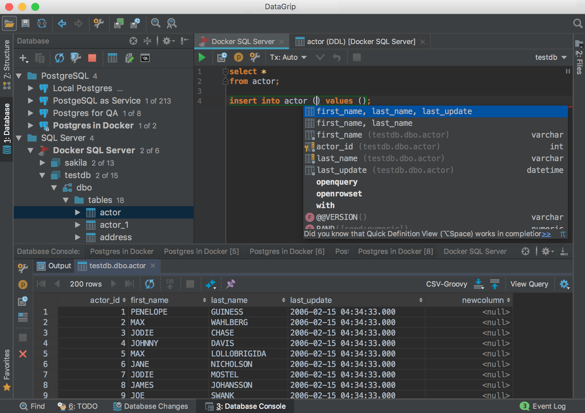

### 1. 高频使用的代码
1. [luigiTask示例](./0xF1.luigi.py)
2. [常用SQL](./0xF0.gist.hql)
3. [常用命令行](./0xF0.gist.sh)
4. [基于sh封装的hive调用](./0xF0.gist.py)

### 2. 提效小技巧DataGrip
1. 查看下自己的hive的版本
   1. cdh 6.3.1
   2. hive 2.1.1
   3. hadoop 3.0.0
2. 再有hive client的机器上下载需要的jar包
   * commons-configuration2-2.1.1.jar
   * hadoop-auth-3.0.0-cdh6.3.1.jar
   * hadoop-common-3.0.0-cdh6.3.1.jar
   * hive-jdbc-2.1.1-cdh6.3.1-standalone.jar
3. 下载DataGrip, 配置driver版本，手动指定上述jar包
4. 使用用户名和密码通过jdbc 链接 hive metastore(hive center 2)
5. 登录后等index建立完毕，写Hive SQL就有智能提示了。
   1. 效果类似，这个是MYSQL的

### 3. 提速小技巧--pyhive

