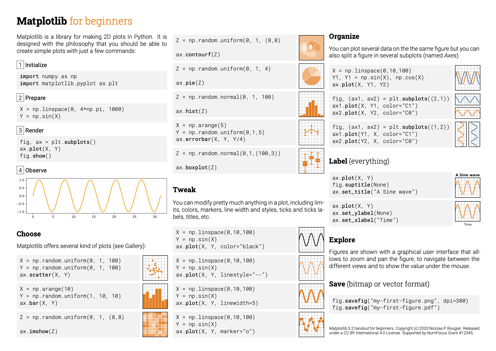
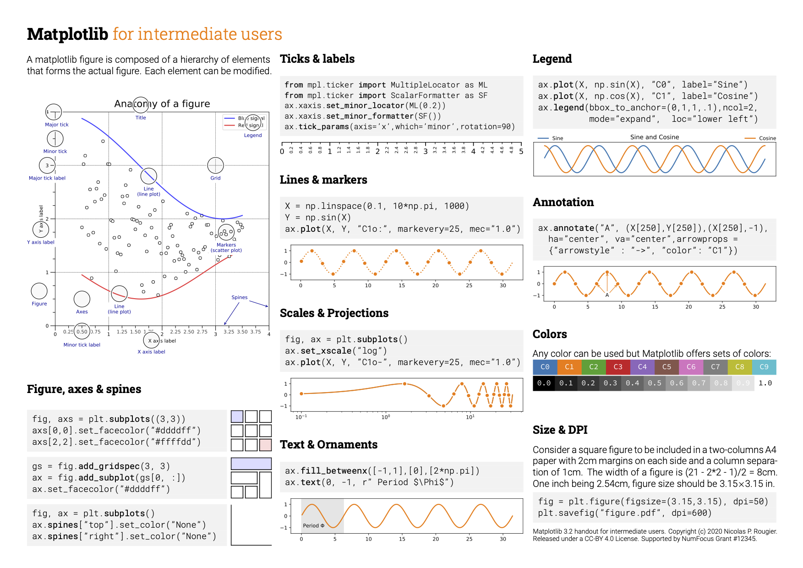
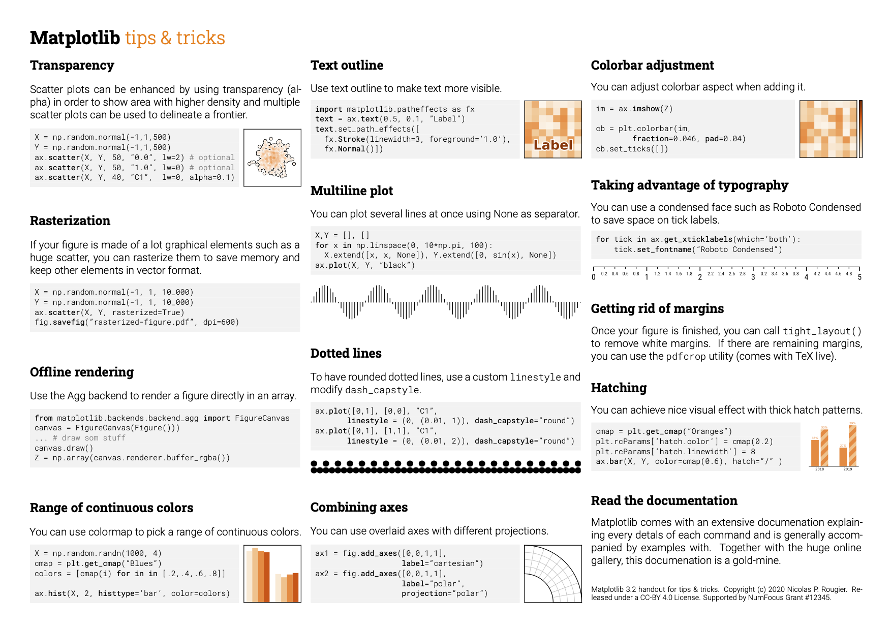

#### 1. 核心概念

1. figure
2. subplot/axes
3. axis/tick/label/locator/formatter
4. legend/title
5. Text/Annotation

#### 2. 琐碎的点

1. 单位换算
   1. 1 inch = 2.54 cm
   2. figsize 的单位为 inch， text等文本的size单位为point
   3. dpi 为每英寸点数，matplotlib默认为72
   4. fontsize=5 默认情况下表示 5/72 inch高度的字
2. 中文字体处理

```python3
import pathlib
import matplotlib as plt
from matplotlib import font_manager

font_path = pathlib.Path("/path/to/some_font.ttf")
# without size
font_properties = font_manager.FontProperties(fname=font_path)
# with size
font_properties_size = font_manager.FontProperties(fname=font_path, size=5)
font_size: int = 5
# ax is an Axes/subplot
# text
ax.text(
    **{
        "fontproperties": font_properties,
        "fontsize": 5
    }
)
# tick
ax.set_yticklabels([], **{
    "fontproperties": font_properties,
    "fontsize": 5
})
ax.set_title(
    "Title", pad=20, fontdict={
        "fontproperties": font_properties,
        "fontsize": 5
    }
)
```

### 8.cheatsheets

* 
* 
* 
* 
* 