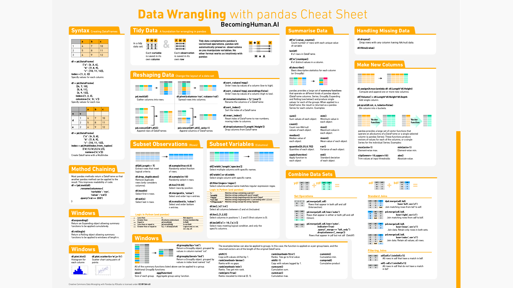
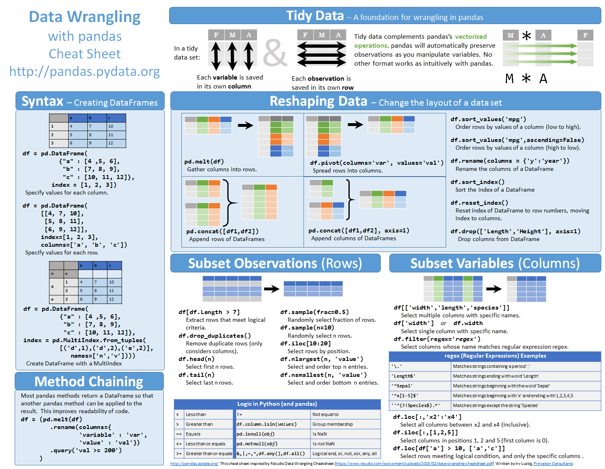
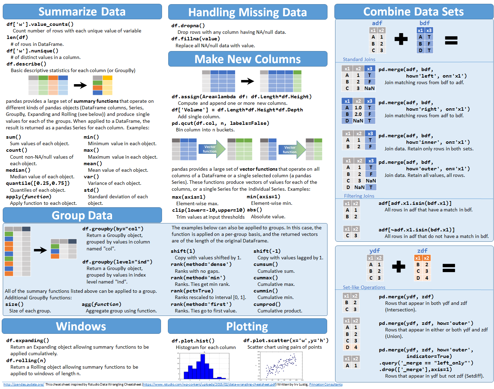

### 1. pandas 单机数据处理

### 2. 核心概念理解和实现

1. series
2. dataframe
3. GroupbyedDataframe

### 3.一些实现原理
1. 基于numpy的紧凑的内存结构
2. CPU的SIMD指令
3. 基于操作符重载的语法：series mask&filter

### 3. cheatsheets
* 
* 
* 

### links
1. [官网](https://pandas.pydata.org/pandas-docs/stable/getting_started/index.html)
2. [另外一些速查表](https://zhuanlan.zhihu.com/p/65405562)
3. [知乎好图]()