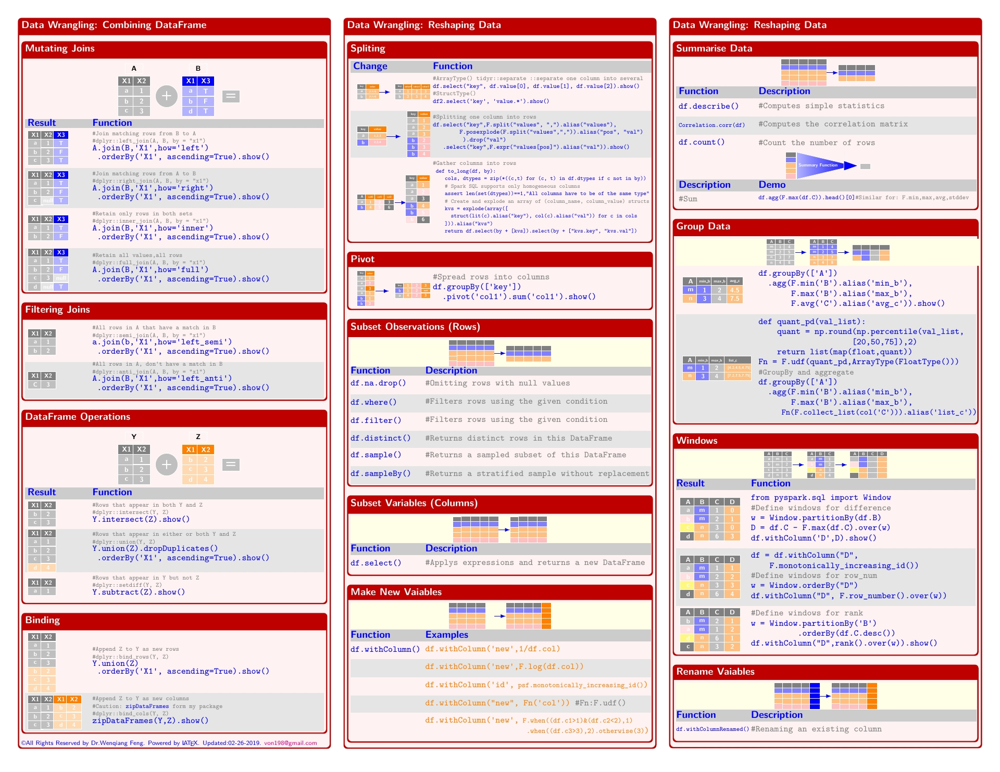
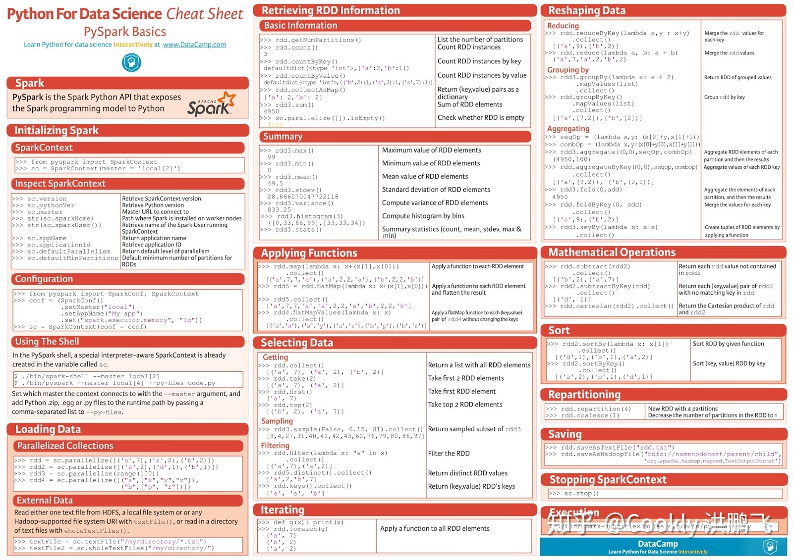

### 1. spark
1. RDD
2. DataFrame
   1. 尽量用高级API, 在跨语言上是一样的行为，scala/java jvm &&  python 一样
   2. 尽量不用python udf 涉及到数据 在python 和jvm 跨进程的序列化传输

### 2. spark 角色
1. master
2. worker

### 2. spark-submit 的CICD
1. conda pack 打成zip包
2. spark-submit 提交到 yarn
3. 在服务器的行为
   1. zip 软链为目录
   2. python 可执行程序执行入口文件

### 4.cheatsheets-pyspark[!尽量用dataframe 而不是rdd]

### links
1. [官网](https://spark.apache.org/)
2. [Data](https://runawayhorse001.github.io/LearningApacheSpark/cheat.html)