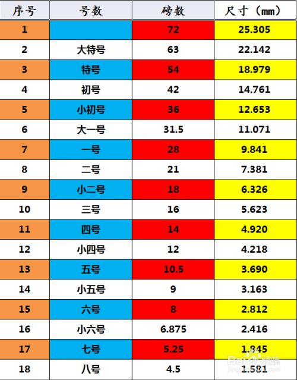

### 0.公制
* 1 inch = 25.4 mm
* 1 inch = 72 point

### 1.纸张
#### 1.1 尺寸(单位mm)
* A1 594 * 841
* A2 420 * 594
* A3 297 * 420
* A4 210 * 297 
* B1 707 * 1000
* B2 500 * 707
* B3 353 * 500

#### 1.2 质量
市面售卖A4纸张一般有500张, 规格一般说70gsm或80gsm, 表示 每平方米的纸张重量是70克或80克
A4铜版纸 160g

### 2.字体/中文大小（号数制与点数制）
1磅表示1point, 字体大小（size) 表示多少磅

### links
1. [Paper size and weights](https://www.prestigeprint.biz/Paper-sizes-and-weights)