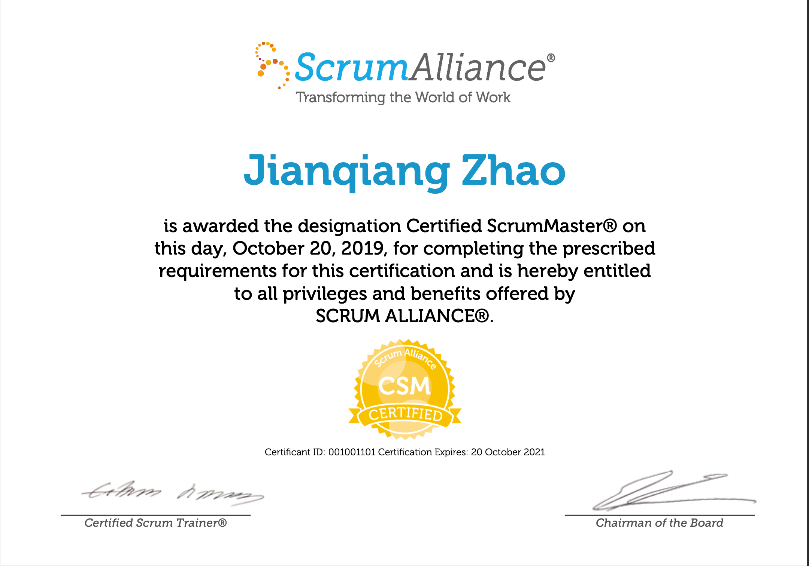

BIO
  * 作为一个较早接触计算机的人，我从开始，就决定不能自我设限，做T型技能，能架构有深度
  * 自己需要频繁测试各种组件和工具，拿一个PC构建一套测试环境，参见这⬇️
  * [Dockerfiles](https://github.com/QunixHacker/dockerfiles)

Roles
  * [DevOps Developer](./DevOps/README.md)
    * Linux / Shell
    * Nginx
    * Kafka / Redis
    * Mysql / Mongo 
    * Docker / Gitlab
  * [FullStack Developer](./FullStack/README.md)
    * 数据开发/数据分析
      * [Pandas](./FullStack/Pandas) / [Matplotlib](./FullStack/Matplotlib)
      * [Hive](./FullStack/Hive) / [Spark](./FullStack/Spark)
    * 应用开发
      * Go
      * Django / Flask / aiohttp

  * [Certified Scrum Master](./Scrum)
    * [结对编程](./Scrum/0XF0.PairPrograming.md)
    * [TDD](./Scrum/0XF1.TDD.md)
    * [BDD](./Scrum/0XF2.BDD.md)
    * [CodeReview](./Scrum/0XF3.CodeReview.md)
    *  
    * 单机构造一个小型测试环境⬇️
    * 
<!---
QunixHacker/QunixHacker is a ✨ special ✨ repository because its `README.md` (this file) appears on your GitHub profile.
You can click the Preview link to take a look at your changes.
--->
