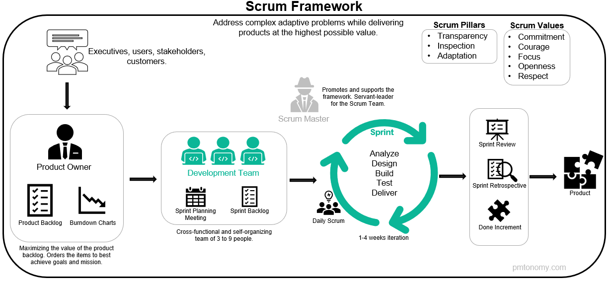
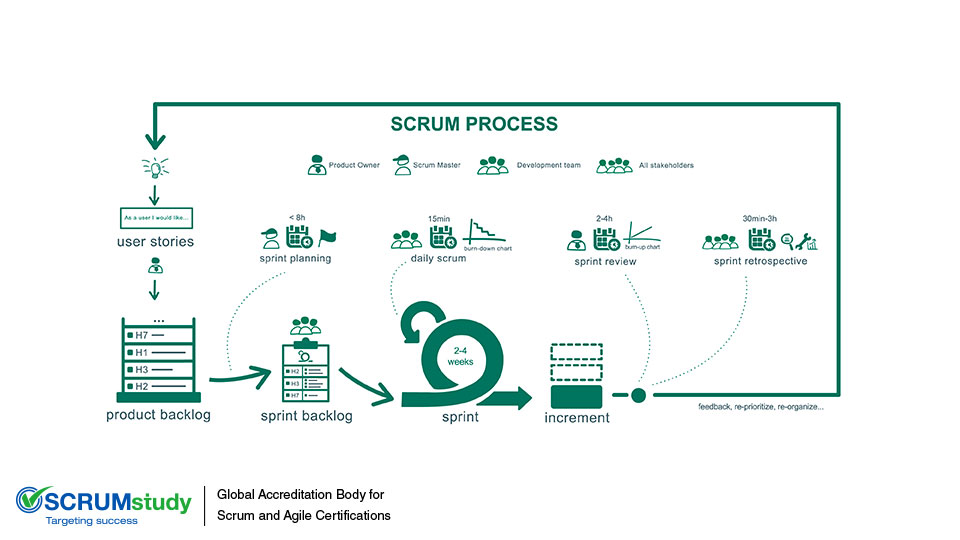

### Scrum Glance

### Core
1. 透明
2. 检验
   1. [CICD](./0X01.CICD.md)/CodeReview/AT
3. 调整
   1. Retro/Showcase
 
### 三个角色
1. Product Owner
2. Scrum Master
3. Scrum Team

### 三个工件
1. Product Backlog(PB,PBI)
   1. Definition of Ready(DOR)
2. Sprint Backlog(SB,SBI)
3. Potential shippable product increment(PSPI)
   1. Definition of Done(DOD)

### 五个活动
1. Sprint Planning(IPM)
2. [Daily Scrum Meeting(Standup)](https://mp.weixin.qq.com/s/fmg_JzGgpYqDw2Fsd8LFMA?version=4.0.0.90415&platform=mac)
3. Sprint Review (Showcase)
4. Retrospective
   1. NVC(非暴力沟通)
5. Backlog Refinement

### links
1. [一场全新的新产品开发游戏](https://zhuanlan.zhihu.com/p/26481537)
2. [Scrum 3355](https://www.jianshu.com/p/ddbcaead1a18)
3. [敏捷其实很简单](https://www.jianshu.com/p/bb914ab6b6dd)
4. [MVP](http://www.woshipm.com/ucd/774702.html)
5. [阿里如何定义团队的研发效能](https://mp.weixin.qq.com/s/aWgIHcz-49dwQYewRUfqgg?version=4.0.0.90415&platform=mac)